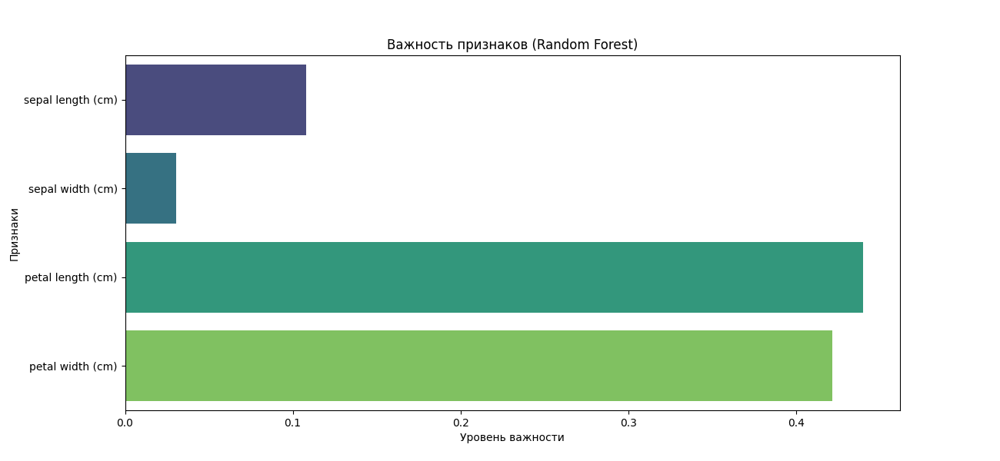

# Лабораторная работа №3: Ансамблевое обучение (Ensemble Learning)

## 🎯 Цель работы
Изучить принципы работы ансамблевых методов машинного обучения, реализовать алгоритмы Бэггинга (Bagging) и Бустинга (Boosting), а также провести анализ значимости признаков.

## 🛠 Используемые алгоритмы
В работе реализованы две мощные ансамблевые модели:
1. **Random Forest (RandomForestClassifier)** — метод бэггинга, использующий голосование множества независимых деревьев решений для снижения риска переобучения.
2. **XGBoost (XGBClassifier)** — современный алгоритм градиентного бустинга, который строит деревья последовательно, исправляя ошибки предыдущих итераций.

## 📊 Результаты и метрики
Обе модели показали исключительную эффективность на наборе данных Iris:
* **Точность (Accuracy) Random Forest:** 1.0000 (100%)
* **Точность (Accuracy) XGBoost:** 1.0000 (100%)

Высокая точность обусловлена качественной предобработкой данных (масштабирование StandardScaler) и мощностью выбранных алгоритмов для классических задач небольшой размерности.

## 🔍 Анализ важности признаков (Feature Importance)
Одной из ключевых задач было определение наиболее значимых характеристик цветка для принятия решения моделью.

**Выводы по графику:**
* Основной вклад в классификацию вносят признаки **Petal Length** (длина лепестка) и **Petal Width** (ширина лепестка). Суммарно они определяют более 80% решения модели.
* Признаки чашелистика (**Sepal**) имеют значительно меньший вес, что подтверждает биологическую специфику ирисов — лепестки являются их главным отличительным признаком.

